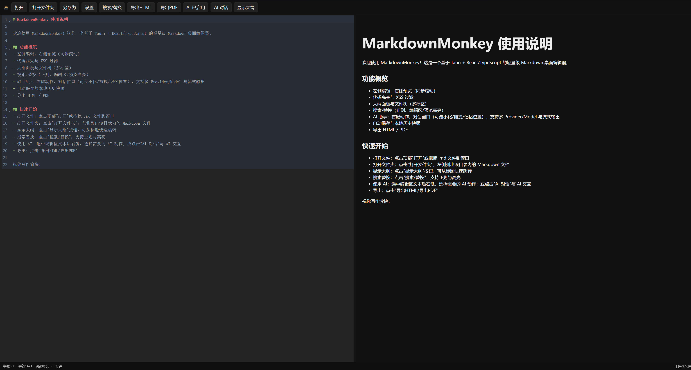

# MarkdownMonkey

      

A modern Markdown desktop editor powered by Tauri (Rust) + React/TypeScript, focused on productivity, safety and local-first.

Highlights:
- Live preview & code highlighting: marked + DOMPurify + highlight.js, synced scrolling, match highlighting in both editor and preview
- Draggable split panes; resizable outline/file-tree sidebar with folding
- Outline & file tree: auto-generated TOC; create/rename/delete/refresh/copy-path; multi-tabs with drag reordering and context actions
- AI assistant: context actions (continue/rewrite/translate/summarize/custom templates), chat window (minimize/drag/persist), provider/model switch, SSE streaming, insert to editor
- Providers: OpenAI-compatible / Claude / DeepSeek / Kimi / OpenRouter / Ollama (local)
- Secure storage: API keys saved in OS keyring (no plaintext on disk)
- Local-first: auto save + local history snapshots (latest 20)
- Export: HTML / PDF (keeps styling and code highlight)
- i18n: zh-CN and en-US included

[中文使用说明](README.zh-CN.md)

> This project is a Vibe Coding project; all code is generated by AI.

 

## Dev

```
pnpm install
pnpm tauri dev
```

## Build

```
pnpm tauri build
```

## Features 

- Editing
  - CodeMirror 6, Markdown highlighting
  - Synced preview, code block highlight, XSS sanitization
  - Paste image into `images/` next to current file and auto insert reference
- Sidebar & tabs
  - Outline: header-based TOC, jump to section, adjustable width
  - File tree: recursive md listing, create/rename/delete/refresh/copy path
  - Tabs: drag reorder, context menu (close current/right/others)
- Search/Replace
  - Regex, ignore-case; highlight matches in editor & preview; prev/next navigate; replace one/all
- AI
  - Context actions: continue/rewrite/translate (zh/en)/summarize; custom templates ({text}/{lang}/{style}/{date}/{filename}/{model}/{provider})
  - Chat: multi-turn, provider/model switch, streaming, minimize/drag/persist, export session, insert to editor
- Security & persistence
  - API key stored in OS keyring; other settings in @tauri-apps/plugin-store
  - File system capability-scoped to HOME/DESKTOP by default
- Export
  - HTML/PDF via html2pdf.js with preserved styles & highlights
- Cross-platform
  - Windows / macOS / Linux (depending on env)

## Usage

1) Basics
   - Open file: top "Open" or drag a `.md` file into window
   - Open folder: top "Open Folder" to list md files in sidebar
   - Tabs: open files become tabs; drag to reorder; context close actions

2) Editing & navigation
   - Outline: toggle "Show Outline", click header to jump; drag to resize
   - Paste image: paste in editor to save into `images/` and insert reference

3) Search/Replace
   - Toggle the toolbar; regex/ignore-case supported; highlights in editor & preview; prev/next; replace one/all

4) AI
   - Enable AI, open "AI Chat"; or select text and right-click for actions
   - Switch provider/model, stream responses, insert to editor; window supports minimize/drag/persist
   - API key is stored securely in OS keyring

5) Export
   - Export HTML/PDF from top bar; PDF is client-side generated with styles & highlights

## Screenshots




## Shortcuts
- Ctrl+O: Open file
- Ctrl+S: Save
- Ctrl+P: (planned) Quick open
- Ctrl+Shift+F: (planned) Global search

## Internationalization
Chinese (zh-CN) and English (en-US) strings are prepared in `src/i18n.ts`. The UI reads `ui_language` from settings (persisted in store).

## License
MIT
