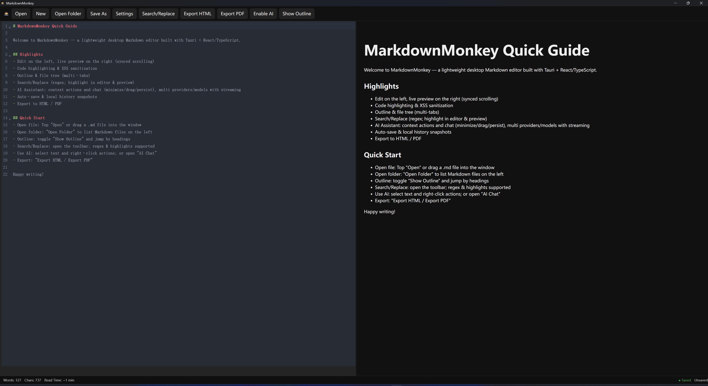

# MarkdownMonkey

      

A modern Markdown desktop editor powered by Tauri (Rust) + React/TypeScript, focused on productivity, safety and local-first.

> This project is a Vibe Coding project; all code is generated by AI.

Highlights:
- Editing & Preview
  - Live preview & code highlighting (marked + DOMPurify + highlight.js)
  - Synced scrolling; match highlighting in editor and preview
  - Word wrap toggle (Alt+Z); editor font zoom (Ctrl+= / Ctrl+- / Ctrl+0)
- Organization
  - Draggable split panes; resizable outline/file-tree sidebar with folding
  - Outline & file tree; multi-tabs with drag reordering and context actions
- AI
  - Context actions (continue/rewrite/translate/summarize/custom templates)
  - Chat window (minimize/drag/persist), provider/model switch, SSE streaming
- Security & Persistence
  - Secure storage (OS keyring), settings persisted via @tauri-apps/plugin-store
  - Local-first auto save; local history snapshots (latest 20)
- Export & Diagrams
  - Export HTML / PDF (preserved styles & highlights)
  - Mermaid diagrams (flowchart/sequence/Gantt/pie), theme-aware
- Cross-platform & i18n
  - Windows / macOS / Linux (depending on env)
  - i18n: zh-CN and en-US included
- For version-specific updates, see CHANGELOG: [CHANGELOG.md](CHANGELOG.md)

[中文使用说明](README.zh-CN.md)


 

## Dev

```
pnpm install
pnpm tauri dev
```

## Build

```
pnpm tauri build
```

## Features

- Editing
  - CodeMirror 6, Markdown highlighting; XSS sanitization
  - Synced preview; auto-save indicator in status bar
  - Focus mode (F11); word wrap toggle; editor font zoom
  - Paste image into `images/` next to current file and auto insert reference
- Navigation & Organization
  - Outline (header-based TOC), adjustable width
  - File tree (create/rename/delete/refresh/copy path)
  - Tabs (drag reorder, close current/right/others)
- Search
  - In‑document: regex/case-insensitive, highlight hits, prev/next, replace one/all
  - Global search (Ctrl+Shift+F): scan workspace Markdown files
- AI
  - Context actions; custom templates ({text}/{lang}/{style}/{date}/{filename}/{model}/{provider})
  - Chat (multi‑turn, provider/model switch, streaming, minimize/drag/persist)
- Security & Persistence
  - OS keyring for API key; settings via @tauri-apps/plugin-store
  - Capability-scoped FS (HOME/DESKTOP by default)
- Export & Diagrams
  - HTML/PDF via html2pdf.js; Mermaid diagrams (theme-aware)

## Usage

- Getting started
  - New/Open/Save from the top bar; drag a `.md` file into the window
  - Open Folder to browse Markdown files; double‑click to open tabs
- Navigate & edit
  - Toggle Outline; click headings to jump; drag to resize sidebar
  - Paste image to auto‑save into `images/` and insert reference
- Search
  - In‑document toolbar for regex/case‑insensitive search and replace
  - Global search (Ctrl+Shift+F) scans current workspace
- AI
  - Enable AI → AI Chat; or select text and use context actions
  - Switch provider/model; streaming output; export chat; insert to editor
- Export
  - Export HTML/PDF; PDF is generated client‑side with preserved styles

## Screenshots


## Shortcuts
- Ctrl+N: New document
- Ctrl+O: Open file
- Ctrl+S: Save
- Ctrl+F: Search/Replace (current document)
- Ctrl+Shift+F: Global search (workspace)
- Ctrl+Shift+P / Ctrl+P: Command palette / Quick open
- F11 / ESC: Toggle focus mode
- Alt+Z: Toggle word wrap
- Ctrl+= / Ctrl+- / Ctrl+0: Editor font zoom + / − / reset

## Internationalization
Chinese (zh-CN) and English (en-US) strings are prepared in `src/i18n.ts`. The UI reads `ui_language` from settings (persisted in store).

## License
MIT
