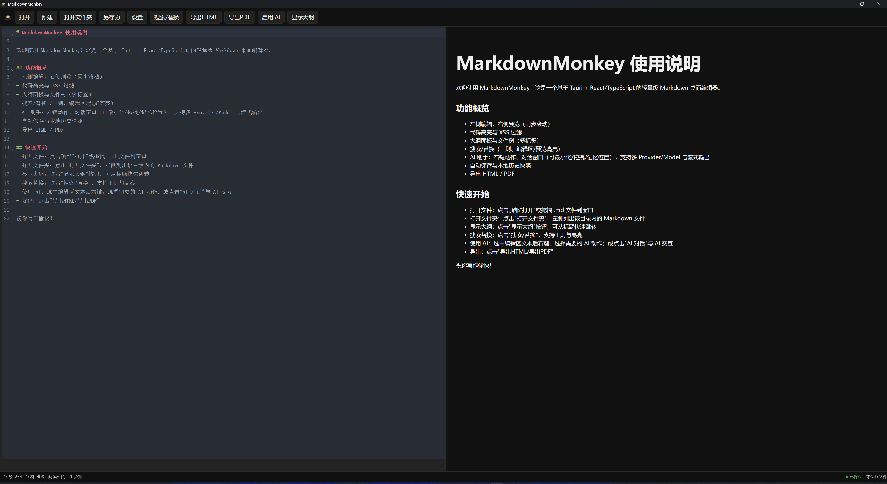

# MarkdownMonkey

      

一个基于 Tauri（Rust）+ React/TypeScript 的现代化 Markdown 桌面编辑器，聚焦“写作效率 + 安全 + 本地优先”。

核心特性：
- 实时预览与代码高亮：marked + DOMPurify + highlight.js，预览与编辑同步滚动，高亮命中支持编辑区与预览区一致显示
- 可拖拽分栏：编辑区/预览区宽度拖拽，侧栏（大纲/文件树）支持独立拖拽与折叠
- 大纲与文件树：自动从文档标题生成大纲；文件树支持多级折叠、重命名、删除、新建、复制路径；多标签编辑，支持标签拖拽排序、右键关闭操作
- AI 助手：右键快捷动作（续写/改写/翻译/总结/自定义模板）、AI 对话窗口（可最小化/拖拽/记忆位置、提供商/模型切换、SSE 流式输出、插入到编辑器）
- 多 Provider 支持：OpenAI 兼容 / Claude / DeepSeek / Kimi / OpenRouter / Ollama（本地模型）
- 安全存储：API Key 加密保存于系统 Keyring（Windows 凭据管理器 / macOS 钥匙串 / Linux Secret Service），不落盘明文
- 本地优先：自动保存 + 本地历史快照（保留最近 20 条），离线可用
- 导出：一键导出 HTML / PDF（保留样式与代码高亮）
- 国际化：内置 `zh-CN` 与 `en-US`，UI 全量 i18n
- **新增功能**：
  - 自动保存指示器：实时显示文档保存状态，3秒自动保存
  - 命令面板（Ctrl+Shift+P）：快速访问所有功能
  - 专注模式（F11）：沉浸式写作体验
  - Mermaid 图表支持：流程图、时序图、甘特图、饼图等
  - 示例演示：参见 [功能演示文档](demo-features.md)

[English Guide](README.md)

> 本项目为 Vibe Coding 项目，所有代码由 AI 生成。

 

## 开发

```
pnpm install
pnpm tauri dev
```

## 构建

```
pnpm tauri build
```

## 功能清单

- 编辑体验
  - CodeMirror 6 编辑器，Markdown 语法高亮
  - 同步滚动预览、代码块高亮、XSS 过滤（DOMPurify）
  - 粘贴图片自动保存到当前文件同级 images/ 并插入引用
  - **自动保存指示器**：状态栏实时显示保存状态（已保存/保存中/未保存），3秒自动保存
  - **专注模式**：F11 进入沉浸式写作，隐藏所有UI，仅保留编辑器
- 侧栏与多标签
  - 大纲：按标题层级生成，点击跳转，支持宽度拖拽
  - 文件树：递归列出 Markdown；支持新建/重命名/删除/刷新/复制路径
  - 标签：支持拖拽排序、右键关闭当前/关闭右侧/仅保留当前
- 搜索与替换
  - 支持正则、忽略大小写；在编辑区与预览区高亮命中；上一处/下一处跳转，替换当前/替换全部
- AI 能力
  - 右键快捷动作：续写、改写、翻译（中/英）、总结，支持自定义模板（变量：{text}/{lang}/{style}/{date}/{filename}/{model}/{provider}）
  - 对话窗口：多轮对话、模型与 Provider 切换、最小化/拖拽/记忆位置、导出会话、插入结果到编辑器
  - SSE 流式输出；最近使用记录；模型列表获取
- 安全与持久化
  - API Key 加密存储于系统 Keyring；设置项使用 @tauri-apps/plugin-store 本地保存
  - 文件系统权限通过 Tauri Capabilities 细粒度限制，仅 HOME/DESKTOP 范围（可按需调整）
- 导出
  - HTML/PDF 导出（html2pdf.js），包含样式与代码高亮，适合归档与分享
  - **Mermaid 图表支持**：自动渲染流程图、时序图、甘特图、饼图等，适配暗色/亮色主题
- 快速访问
  - **命令面板**：Ctrl+Shift+P 打开，搜索并快速执行任何功能，支持键盘导航
- 跨平台
  - Windows / macOS / Linux（实际可用程度以各平台运行环境为准）

## 使用步骤

1) 启动与基础
   - 新建文档：顶部"新建"创建空白文档
   - 打开文件：顶部"打开"或拖拽 `.md` 进入窗口
   - 打开文件夹：点击"打开文件夹"，左侧显示该目录内的 Markdown 文件
   - 多标签：双击文件/从文件树打开即加入标签，可拖拽排序，右键菜单支持关闭控制

2) 编辑与导航
   - 大纲：点击“显示大纲”切换，点击标题可跳转；侧栏可拖拽调整宽度
   - 粘贴图片：在编辑器里粘贴图片，自动保存到当前目录 images/ 并插入 `` 引用

3) 搜索替换
   - 点击“搜索/替换”打开工具条，支持正则/忽略大小写；在编辑区与预览区同步高亮命中
   - 上/下跳转定位，支持替换当前与替换全部

4) AI 功能
   - 启用 AI：点击“启用 AI”，再点“AI 对话”可打开聊天窗
   - 右键快捷动作：在编辑区选中文本后右键，选择续写/改写/翻译/总结或自定义模板
   - 对话窗：可切换 Provider/Model，支持流式输出、插入结果到编辑器；可最小化、拖拽、记忆位置
   - 安全存储：API Key 在设置中填写后将加密写入系统 Keyring，后续自动读取

5) 导出
   - 顶部按钮支持导出 HTML / PDF；PDF 由前端生成，保留样式与高亮

## 截图

<!-- 将实际截图放入 assets/ 目录并提交。以下为占位路径。 -->


## 快捷键
- Ctrl+N：新建文档
- Ctrl+O：打开文件
- Ctrl+S：保存
- Ctrl+F：搜索替换
- Ctrl+Shift+P：命令面板
- F11：专注模式（再次按下或ESC退出）
- Ctrl+P：计划中（快速打开）
- Ctrl+Shift+F：计划中（全局搜索）

## 国际化
内置 `zh-CN` 与 `en-US` 两套文案；在设置里切换语言后即时生效，AI 相关弹窗与提示也已本地化。

## 许可证
MIT
