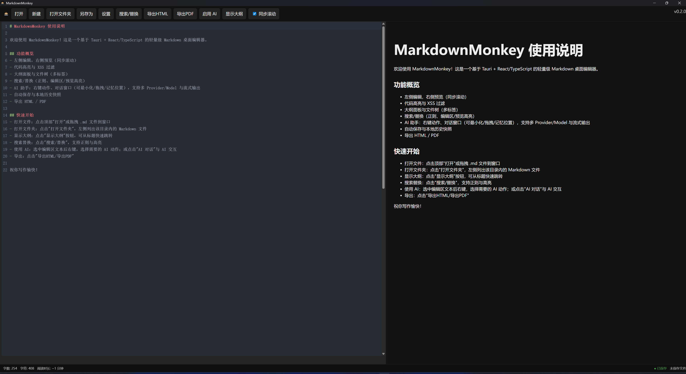

# MarkdownMonkey

[English Guide](README.md)

      

一个基于 Tauri（Rust）+ React/TypeScript 的现代化 Markdown 桌面编辑器，聚焦“写作效率 + 安全 + 本地优先”。

> 本项目为 Vibe Coding 项目，所有代码由 AI 生成。

核心特性：

- 编辑与预览
  - 实时预览与代码高亮（marked + DOMPurify + highlight.js）
  - 编辑/预览同步滚动；命中高亮一致
  - 自动换行开关（Alt+Z）；编辑器字号缩放（Ctrl+= / Ctrl+- / Ctrl+0）
- 组织与布局
  - 可拖拽分栏；侧栏（大纲/文件树）支持独立拖拽与折叠
  - 大纲与文件树；多标签拖拽排序、右键关闭等
- AI 助手
  - 右键快捷动作（续写/改写/翻译/总结/自定义模板）
  - AI 对话（最小化/拖拽/记忆位置）、Provider/Model 切换、流式输出
- 安全与持久化
  - API Key 加密保存于系统 Keyring；设置持久化（@tauri-apps/plugin-store）
  - 本地优先自动保存；本地历史快照（保留最近 20 条）
- 导出与图表
  - 一键导出 HTML / PDF（保留样式与高亮）
  - Mermaid 图表（流程/时序/甘特/饼图），适配明暗主题
- 跨平台与国际化
  - Windows / macOS / Linux（取决于环境）
  - 内置 `zh-CN` 与 `en-US`
- 各版本更新请参见：[CHANGELOG.md](CHANGELOG.md)

## 文档

- [用户手册](docs/USER_MANUAL.zh-CN.md) - 完整的使用指南和功能说明。
- [AI 使用教程](docs/AI_TUTORIAL.zh-CN.md) - AI 功能配置和使用教程。
- [常见问题](docs/FAQ.zh-CN.md) - 常见问题解答。
- [架构指南](docs/ARCHITECTURE.zh-CN.md) - 了解模块化的 Hooks 架构。
- [贡献指南](docs/CONTRIBUTING.zh-CN.md) - 如何设置和构建项目。
- [更新日志](CHANGELOG.md) - 版本历史。

## 开发

```
pnpm install
pnpm tauri dev
```

## 构建

```
pnpm tauri build
```

## 功能清单

- 编辑体验
  - CodeMirror 6；Markdown 高亮；XSS 过滤
  - 同步预览；自动保存指示器；专注模式（F11）
  - 自动换行开关；编辑器字号缩放；格式化快捷键（加粗/斜体/行内代码）
  - 粘贴图片自动保存至 `images/` 并插入引用
- 导航与组织
  - 大纲（按标题层级生成、点击跳转、可调宽度）
  - 文件树（新建/重命名/删除/刷新/复制路径）
  - 多标签（拖拽排序、右键关闭当前/右侧/仅保留）
- **新功能 (v0.3.0)**
  - **图片管理器**: 查看所有图片、压缩本地图片（低/中/高画质）、网格视图
  - **表格编辑器**: 可视化 Excel 风格编辑、添加/删除行列、自动格式化
  - **快捷键帮助**: 内置快捷键参考（点击工具栏 "⌨️ 快捷键"）
  - **性能优化**: 大文件检测（>10MB 警告）、自动保存防抖优化
- 搜索
  - 文内搜索替换：正则/忽略大小写，命中高亮，上一处/下一处/替换
  - 全局搜索（Ctrl+Shift+F）：扫描当前工作区 Markdown 文件
- AI 能力
  - 右键快捷动作与自定义模板（{text}/{lang}/{style}/{date}/{filename}/{model}/{provider}）
  - AI 对话（切换 Provider/Model、流式输出、最小化/拖拽、导出/插入）
- 安全与持久化
  - API Key 加密存储于系统 Keyring；设置项本地持久化
  - Capabilities 细粒度文件权限（默认 HOME/DESKTOP）；外部文件变更检测与重载提示
- 导出与图表
  - HTML/PDF 导出；Mermaid 图表（适配主题）

## 使用步骤

- 基础
  - 顶部栏新建/打开/保存；也可拖拽 `.md` 到窗口
  - 打开文件夹后在侧栏浏览/双击打开为标签
- 编辑与导航
  - 切换大纲并点击标题跳转；侧栏可拖拽调整宽度
  - 粘贴图片自动保存并插入引用
- 搜索
  - 文内：工具条支持正则/忽略大小写，命中高亮、替换
  - 全局：Ctrl+Shift+F 打开全局搜索并扫描工作区
- AI
  - 启用 AI → 打开 AI 对话；或选中文本使用右键快捷动作
  - 支持 Provider/Model 切换、流式输出、导出会话、插入到编辑器
- 导出
  - 顶部按钮导出 HTML/PDF；PDF 保留样式与代码高亮

## 截图

### 主界面




## 快捷键

- Ctrl+N：新建文档
- Ctrl+O：打开文件
- Ctrl+S：保存
- Ctrl+F：文内搜索替换
- Ctrl+Shift+F：全局搜索（工作区）
- Ctrl+Shift+P / Ctrl+P：命令面板 / 快速打开
- F11 / ESC：切换专注模式
- Alt+Z：切换自动换行
- Ctrl+= / Ctrl+- / Ctrl+0：编辑器字号 放大 / 缩小 / 重置
- Ctrl+B / Ctrl+I / Ctrl+`：加粗 / 斜体 / 行内代码
- Ctrl+Shift+L：显示/隐藏行号

## 国际化

内置 `zh-CN` 与 `en-US` 两套文案；在设置里切换语言后即时生效，AI 相关弹窗与提示也已本地化。

## 许可证

MIT
