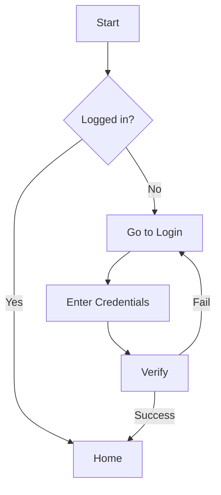
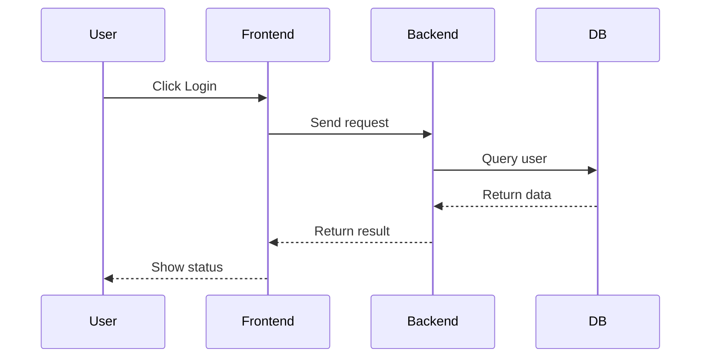
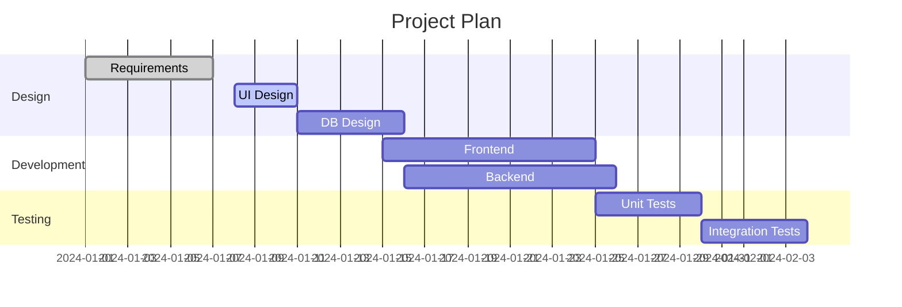
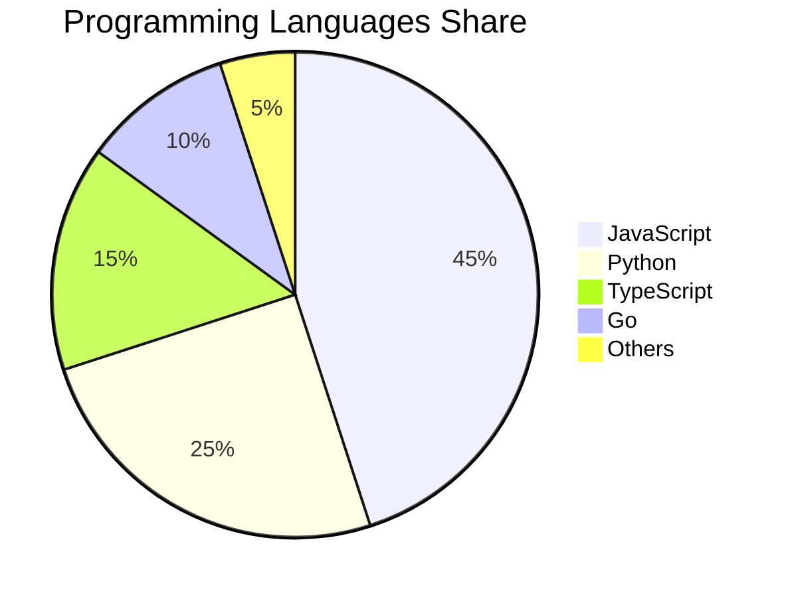

# MarkdownMonkey Feature Demos

## 1. Auto-save Indicator
Edit this document and watch the save status in the bottom-right of the status bar:
- 🔴 Unsaved — shows immediately after typing
- 🟠 Saving... — shown during the 3-second auto-save window
- 🟢 Saved — shown after a successful save (with timestamp)

## 2. Command Palette
Press **Ctrl+Shift+P** to open the command palette and quickly access:
- File actions (New, Open, Save)
- Export (HTML / PDF)
- UI toggles (Theme / Language / Outline)
- Focus mode toggle

## 3. Focus Mode
Press **F11** to enter focus mode:
- Hide all non-essential UI
- Keep only the editor visible
- Larger font size and line height
- Exit with ESC or F11

## 4. Mermaid Diagram Support

### Flowchart

### Sequence Diagram

### Gantt Chart

### Pie Chart

## Shortcuts
- **Ctrl+N** — New document
- **Ctrl+O** — Open file
- **Ctrl+S** — Save
- **Ctrl+F** — Search / Replace
- **Ctrl+Shift+P** — Command palette
- **F11** — Focus mode

Enjoy a faster Markdown writing experience! 🚀
