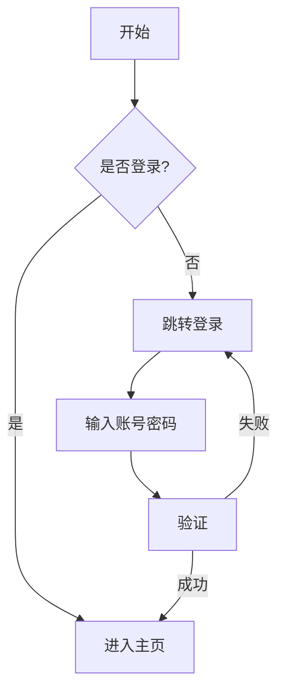
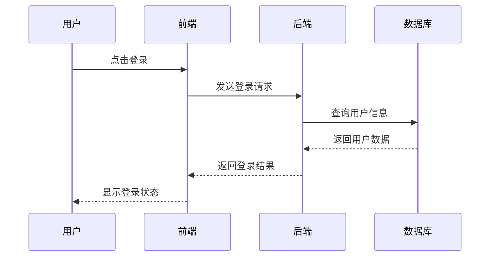
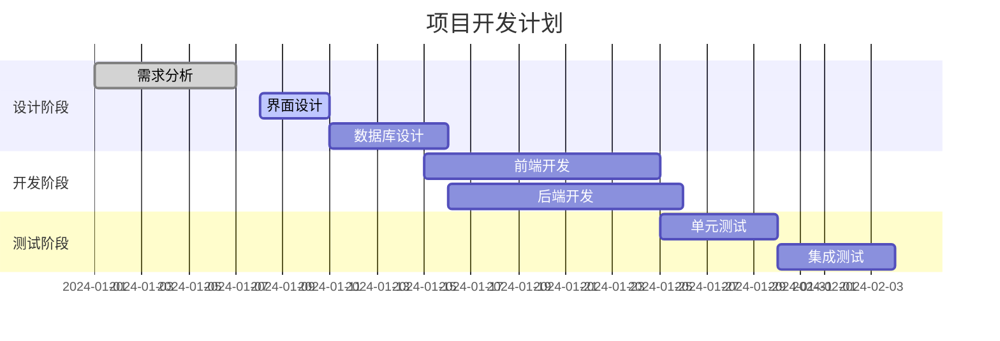
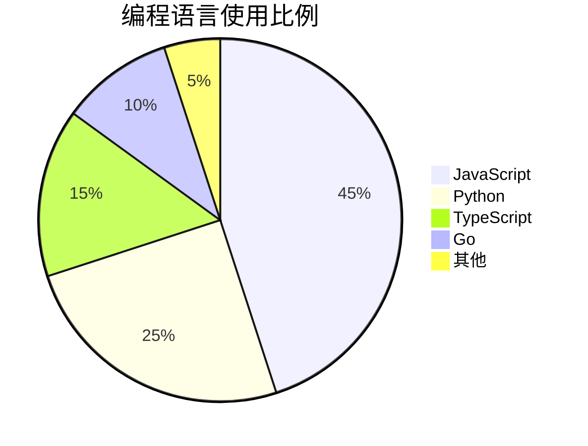

# MarkdownMonkey 新功能演示

## 1. 自动保存指示器
编辑这个文档，你会看到状态栏右下角显示保存状态：
- 🔴 未保存 - 编辑后立即显示
- 🟠 保存中... - 3秒后自动保存时显示
- 🟢 已保存 - 保存成功后显示（带时间戳）

## 2. 命令面板
按下 **Ctrl+Shift+P** 打开命令面板，可以快速访问所有功能：
- 文件操作（新建、打开、保存）
- 导出功能（HTML、PDF）
- 界面切换（主题、语言、大纲）
- 专注模式切换

## 3. 专注模式
按下 **F11** 进入专注模式：
- 隐藏所有UI元素
- 只保留编辑器
- 更大的字体和行距
- 按 ESC 或 F11 退出

## 4. Mermaid 图表支持

### 流程图示例

### 时序图示例

### 甘特图示例

### 饼图示例

## 快捷键汇总
- **Ctrl+N** - 新建文档
- **Ctrl+O** - 打开文件
- **Ctrl+S** - 保存
- **Ctrl+F** - 搜索替换
- **Ctrl+Shift+P** - 命令面板
- **F11** - 专注模式

享受更高效的 Markdown 写作体验！🚀
