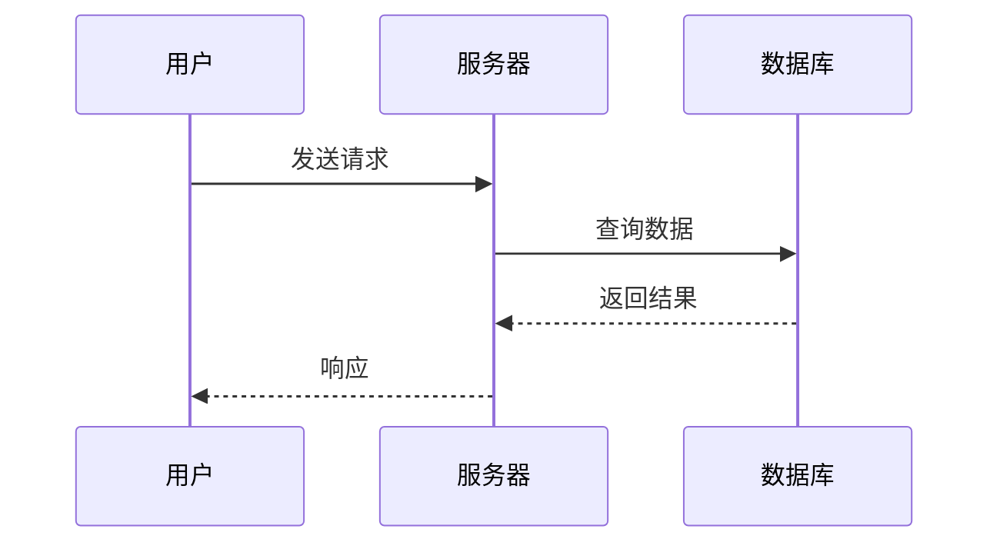

# MarkdownMonkey 用户手册

> 版本: 0.2.0  
> 更新日期: 2025-12-01

---

## 📖 目录

1. [快速开始](#快速开始)
2. [编辑功能](#编辑功能)
3. [导航与组织](#导航与组织)
4. [搜索功能](#搜索功能)
5. [AI 功能配置](#ai-功能配置)
6. [导出功能](#导出功能)
7. [快捷键参考](#快捷键参考)
8. [高级功能](#高级功能)
9. [安全与隐私](#安全与隐私)
10. [常见问题](#常见问题)

---

## 快速开始

### 安装和启动

1. 下载并安装 MarkdownMonkey
2. 双击运行应用
3. 开始编辑您的 Markdown 文档

### 界面布局

```
┌─────────────────────────────────────────────────┐
│  [菜单栏]  新建 打开 保存 导出 AI对话 设置 ... │
├──────────┬──────────────────────┬───────────────┤
│          │                      │               │
│  侧边栏  │    ✏️ 编辑器         │  👁️ 预览     │
│  大纲/   │    (CodeMirror 6)   │  (实时渲染)   │
│  文件树  │                      │               │
│ [可拖拽] │                      │               │
│          │                      │               │
└──────────┴──────────────────────┴───────────────┘
│  [状态栏]  字数: 1234  字符: 5678  阅读时长...  │
└─────────────────────────────────────────────────┘
```

### 三种使用方式

**方式 1: 单个文件**

- 点击 `新建` 或 `打开` 按钮
- 开始编辑

**方式 2: 拖拽文件**

- 将 `.md` 文件拖拽到窗口
- 自动打开并显示

**方式 3: 打开文件夹**

- 点击 `打开文件夹`
- 侧边栏显示文件树
- 双击文件打开为标签

---

## 编辑功能

### ✍️ CodeMirror 6 编辑器

MarkdownMonkey 使用业界领先的 CodeMirror 6 编辑器，提供：

**核心特性**:

- ✅ Markdown 语法高亮
- ✅ 跨平台一致体验
- ✅ 高性能响应
- ✅ 丰富的编辑功能

---

### 📝 Markdown 语法支持

#### 基础格式

**文本样式**:

```markdown
**粗体** (Ctrl+B)
_斜体_ (Ctrl+I)
~~删除线~~
`行内代码` (Ctrl+`)
```

**标题**:

```markdown
# 一级标题

## 二级标题

### 三级标题

#### 四级标题

##### 五级标题

###### 六级标题
```

**列表**:

```markdown
- 无序列表项
  - 嵌套项
  - 另一个嵌套项

1. 有序列表项
2. 第二项
   1. 嵌套有序列表
```

**引用**:

```markdown
> 这是引用
> 可以多行
>
> > 嵌套引用
```

**链接和图片**:

```markdown
[链接文本](https://example.com)
[带标题的链接](https://example.com '鼠标悬停显示')


```

**代码块**:

````markdown
```python
def hello():
    print("Hello, World!")
```

```javascript
function hello() {
  console.log('Hello, World!')
}
```
````

**表格**:

```markdown
| 列1   | 列2   | 列3   |
| ----- | ----- | ----- |
| 数据1 | 数据2 | 数据3 |
| 数据4 | 数据5 | 数据6 |
```

**分隔线**:

```markdown
---

---

---
```

---

### 🎨 编辑器增强功能

#### 字号缩放

**快捷键**:

- `Ctrl+=` (或 `Ctrl+鼠标滚轮上`) - 放大
- `Ctrl+-` (或 `Ctrl+鼠标滚轮下`) - 缩小
- `Ctrl+0` - 重置到默认大小

#### 自动换行

**快捷键**: `Alt+Z`

- 开启：长行自动换行显示
- 关闭：长行需要横向滚动

#### 行号显示

**快捷键**: `Ctrl+Shift+L`

- 显示/隐藏行号

#### 格式化快捷键

| 快捷键      | 功能         |
| ----------- | ------------ |
| `Ctrl+B`    | 加粗选中文本 |
| `Ctrl+I`    | 斜体选中文本 |
| ``Ctrl+` `` | 行内代码     |

---

### 🖼️ 图片粘贴

**强大功能**: 自动保存并插入图片引用

**使用方法**:

1. 复制图片（从网页、截图工具等）
2. 在编辑器中 `Ctrl+V` 粘贴
3. 自动发生：
   - 图片保存到 `images/` 文件夹
   - 自动插入 Markdown 引用：``

**支持格式**:

- PNG
- JPG/JPEG
- GIF
- WebP
- BMP

---

### 🔄 实时预览

#### 预览特性

**同步滚动**:

- 编辑器滚动，预览区域同步滚动
- 点击菜单栏按钮切换：`自动滚动：开/关`

**实时渲染**:

- 输入即时渲染
- 支持 Markdown、代码高亮、Mermaid 图表

**XSS 防护**:

- 使用 DOMPurify 清理 HTML
- 防止恶意代码执行

**代码高亮**:

- 使用 highlight.js
- 支持 100+ 编程语言
- 自动识别语言

---

### 🎯 专注模式

**快捷键**: `F11` (或 `ESC` 退出)

**效果**:

- 隐藏侧边栏
- 最大化编辑和预览空间
- 适合专注写作

---

### 💾 自动保存

**功能**:

- 本地优先：修改自动保存到内存
- 显示保存指示器
- 保存历史快照（最近 20 条）

**手动保存**:

- 快捷键: `Ctrl+S`
- 保存到磁盘

---

## 导航与组织

### 📑 标签管理

#### 多标签支持

**打开标签**:

- 打开多个文件，每个文件一个标签
- 标签显示在编辑器顶部

**切换标签**:

- **点击**: 点击标签切换
- **快捷键**:
  - `Ctrl+Tab` - 下一个标签（循环）
  - `Ctrl+Shift+Tab` - 上一个标签（反向循环）

**关闭标签**:

- 点击标签上的 `×` 按钮
- 快捷键: `Ctrl+W`

**标签右键菜单**:

- 关闭其他 - 关闭除当前标签外的所有标签
- 关闭右侧 - 关闭当前标签右侧的所有标签
- **关闭所有标签** - 关闭所有标签
- 复制路径 - 复制文件路径到剪贴板
- 在文件树中定位 - 在侧边栏文件树中定位当前文件

**长文件名处理**:

- 自动截断超长文件名（显示前 200px）
- 鼠标悬停显示完整名称

---

### 📂 大纲视图

**功能**:

- 自动提取文档标题（H1-H6）
- 生成层级结构
- 点击标题快速跳转

**使用方法**:

1. 点击侧边栏 `大纲` 标签
2. 查看文档结构
3. 点击任意标题跳转到对应位置

**可调宽度**:

- 拖拽侧边栏边框调整宽度
- 折叠/展开侧边栏

---

### 🌳 文件树

**功能**:

- 浏览工作区所有文件
- 管理文件（新建、重命名、删除）
- 刷新、复制路径

**使用方法**:

1. 点击菜单栏 `打开文件夹`
2. 选择工作区文件夹
3. 侧边栏显示文件树

**文件操作**:

- **双击文件**: 打开为标签
- **右键菜单**:
  - 新建 - 创建新文件
  - 重命名 - 重命名文件
  - 删除 - 删除文件
  - 刷新 - 刷新文件树
  - 复制路径 - 复制文件路径

**工作区根目录**:

- 打开文件夹后，该文件夹成为工作区
- 全局搜索范围限定在工作区

---

### 🎛️ 可拖拽布局

**分栏拖拽**:

- 拖拽编辑器和预览区域之间的分隔线
- 调整编辑器和预览的宽度比例

**侧边栏拖拽**:

- 拖拽侧边栏边框
- 调整侧边栏宽度

**侧边栏折叠**:

- 点击折叠按钮
- 最大化编辑空间

---

## 搜索功能

### 🔍 文内搜索替换

**打开搜索**: `Ctrl+F`

**搜索选项**:

- **查找**: 输入搜索词
- **替换为**: 输入替换文本
- **正则表达式**: 启用正则搜索
- **忽略大小写**: 不区分大小写

**操作按钮**:

- `查找` - 高亮所有匹配项
- `上一处` - 跳转到上一个匹配
- `下一处` - 跳转到下一个匹配
- `替换` - 替换当前匹配
- `全部替换` - 替换所有匹配

**命中高亮**:

- 所有匹配项高亮显示
- 当前匹配项特殊标记
- 与编辑器/预览同步

---

### 🌐 全局搜索

**打开全局搜索**: `Ctrl+Shift+F`

**功能**:

- 扫描**整个工作区**的所有 Markdown 文件
- 显示所有匹配结果
- 点击结果跳转到对应文件和位置

**搜索选项**:

- 正则表达式
- 忽略大小写

**搜索范围**:

- 限定在当前工作区（通过 `打开文件夹` 设置）
- 不包括子文件夹中的 `.git` 等隐藏文件夹

---

## AI 功能配置

### 🤖 支持的 AI 提供商

MarkdownMonkey 支持三种类型的 AI 服务：

#### 1. OpenAI (兼容 API)

支持所有使用 OpenAI API 格式的服务：

- OpenAI 官方
- **DeepSeek** (国内推荐)
- **Kimi** (Moonshot AI)
- **通义千问** (Qwen)
- **智谱 AI** (ChatGLM)
- Gemini
- Azure OpenAI
- **OpenRouter**

#### 2. Claude

- Anthropic 的 Claude 模型

#### 3. Ollama (本地)

- 本地运行的开源模型
- 完全免费，无需网络

---

### ⚙️ 配置步骤

#### 快速配置

1. **打开设置**: 点击菜单栏 `设置` 按钮
2. **AI 设置**: 点击 `AI 设置` 标签
3. **选择提供商**: `OpenAI (兼容 API)` / `Claude` / `Ollama`
4. **查看示例**: 点击 `📋 常用配置示例（点击展开）`
5. **填写配置**:
   - API Base URL（从示例复制）
   - API Key（从提供商网站获取）
   - 模型名称（从示例复制）
6. **测试连接**: 点击 API Key 旁的 `测试` 按钮
7. **保存**: 点击 `保存` 按钮

#### 配置示例

**DeepSeek** (推荐国内用户):

```
API Base URL: https://api.deepseek.com
API Key: [您的 DeepSeek API Key]
模型: deepseek-chat
```

**Kimi**:

```
API Base URL: https://api.moonshot.cn/v1
API Key: [您的 Kimi API Key]
模型: moonshot-v1-8k
```

**通义千问**:

```
API Base URL: https://dashscope.aliyuncs.com/compatible-mode/v1
API Key: [您的阿里云 API Key]
模型: qwen-max
```

**Ollama** (本地免费):

```bash
# 1. 安装 Ollama
# 访问 https://ollama.com/

# 2. 下载模型
ollama pull llama3

# 3. 启动服务
ollama serve
```

MarkdownMonkey 配置:

```
提供商: Ollama (本地)
API Base URL: http://127.0.0.1:11434
模型: llama3
无需 API Key
```

---

### 💬 使用 AI 功能

#### 方式 1: AI 对话窗口

**打开对话**:

- 点击菜单栏 `AI 对话` 按钮
- 或点击 `启用 AI` → `AI 对话`

**界面功能**:

- **流式输出**: AI 回复逐字显示
- **切换 Provider/Model**: 实时切换不同的 AI 服务
- **导出会话**: 保存对话内容
- **插入到编辑器**: 将 AI 回复插入到当前文档
- **最小化**: 最小化窗口继续编辑
- **拖拽**: 拖动窗口到任意位置
- **记忆位置**: 自动记住窗口位置和大小

**操作**:

1. 输入您的问题或需求
2. 按 `Enter` 发送（`Shift+Enter` 换行）
3. AI 流式回复
4. 可以继续对话、插入内容或导出

---

#### 方式 2: 右键快捷动作

**内置快捷动作**:

**选中文本后右键**:

- **续写（选中）** - AI 基于选中内容继续写作
- **改写（选中）** - 重新表述选中内容
- **翻译为中文** - 英文→中文
- **翻译为英文** - 中文→英文
- **总结要点（选中）** - 提取关键信息

**不选中文本，直接右键**:

- **续写（全文）** - 基于整个文档续写
- **总结要点（全文）** - 总结整篇文档

**自定义模板**:

- 在设置 → `提示模板` 中创建
- 使用占位符自定义提示词

---

#### 方式 3: 自定义提示模板

**占位符支持**:

- `{text}` - 选中文本或全文内容
- `{lang}` - 语言变量（如 zh-CN/en-US）
- `{style}` - 风格变量（如 简洁/正式）
- `{date}` - 当前日期（yyyy-mm-dd）
- `{filename}` - 当前文件名
- `{model}` - 当前使用的模型
- `{provider}` - 当前使用的提供商

**创建模板**:

1. 设置 → `提示模板` 标签
2. 点击 `+ 新建模板`
3. 填写：
   - 标题
   - 作用域（选中/全文）
   - 提示词（使用占位符）
   - 变量（可选）
4. 启用复选框
5. 保存

**示例模板**:

```
标题: 改写为博客风格
作用域: 选中
提示词:
请将以下内容改写为轻松友好的博客风格，保持技术准确性：

{text}

语言：{lang}
风格：{style}
```

---

### 🎛️ AI 设置调整

**系统提示词**:

- 定义 AI 的角色和行为
- 例如："你是一个专业的 Markdown 写作助手"

**温度参数** (0.0-1.0):

- **低温** (0.3-0.5): 更精确、确定性强（适合翻译、总结）
- **中温** (0.7): 平衡（默认）
- **高温** (0.8-1.0): 更创造性、随机性强（适合创意写作）

---

## 导出功能

### 📤 导出 HTML

**功能**:

- 将 Markdown 转换为 HTML
- 保留样式和代码高亮
- 包含 Mermaid 图表

**使用方法**:

1. 点击菜单栏 `导出 HTML`
2. 选择保存位置
3. 生成 HTML 文件

**特性**:

- 包含内嵌 CSS
- 代码块语法高亮
- Mermaid 图表渲染
- 可直接在浏览器打开

---

### 📄 导出 PDF

**功能**:

- 生成 PDF 文档
- 保留完整格式
- 包含代码高亮和图表

**使用方法**:

1. 点击菜单栏 `导出 PDF`
2. 选择保存位置
3. 等待生成（可能需要几秒）

**特性**:

- 高质量输出
- 保留所有样式
- Mermaid 图表转为图片
- 代码高亮完整保留

---

### 📊 Mermaid 图表支持

**支持的图表类型**:

- **流程图** (Flowchart)
- **时序图** (Sequence Diagram)
- **甘特图** (Gantt Chart)
- **饼图** (Pie Chart)
- 类图、状态图等

**示例 - 流程图**:

````markdown

````

**示例 - 时序图**:

````markdown

````

**主题适配**:

- 自动适配明暗主题
- 跟随应用主题切换

---

## 快捷键参考

### 文件操作

| 快捷键         | 功能     |
| -------------- | -------- |
| `Ctrl+N`       | 新建文档 |
| `Ctrl+O`       | 打开文件 |
| `Ctrl+S`       | 保存文件 |
| `Ctrl+Shift+S` | 另存为   |

### 标签管理

| 快捷键           | 功能                   |
| ---------------- | ---------------------- |
| `Ctrl+Tab`       | 下一个标签（循环）     |
| `Ctrl+Shift+Tab` | 上一个标签（反向循环） |
| `Ctrl+W`         | 关闭当前标签           |

### 搜索

| 快捷键         | 功能               |
| -------------- | ------------------ |
| `Ctrl+F`       | 文内搜索替换       |
| `Ctrl+Shift+F` | 全局搜索（工作区） |

### 快速操作

| 快捷键         | 功能         |
| -------------- | ------------ |
| `Ctrl+Shift+P` | 命令面板     |
| `Ctrl+P`       | 快速打开文件 |

### 视图

| 快捷键 | 功能         |
| ------ | ------------ |
| `F11`  | 切换专注模式 |
| `ESC`  | 退出专注模式 |

### 编辑器

| 快捷键         | 功能          |
| -------------- | ------------- |
| `Alt+Z`        | 切换自动换行  |
| `Ctrl+=`       | 字号放大      |
| `Ctrl+-`       | 字号缩小      |
| `Ctrl+0`       | 字号重置      |
| `Ctrl+Shift+L` | 显示/隐藏行号 |

### 格式化

| 快捷键      | 功能     |
| ----------- | -------- |
| `Ctrl+B`    | 加粗     |
| `Ctrl+I`    | 斜体     |
| ``Ctrl+` `` | 行内代码 |

---

## 高级功能

### 🔐 安全与隐私

#### API Key 加密存储

**特性**:

- API Key 加密保存于**系统 Keyring**
- Windows: Credential Manager
- macOS: Keychain
- Linux: Secret Service

**优势**:

- ✅ 系统级加密
- ✅ 不存储明文
- ✅ 安全性高

#### 设置持久化

**功能**:

- 使用 `@tauri-apps/plugin-store`
- 所有设置本地存储
- 重启应用自动恢复

---

### 📁 文件权限管理

#### Capabilities 细粒度权限

**默认权限**:

- HOME 目录
- DESKTOP 目录

**安全考虑**:

- 限制文件访问范围
- 防止恶意文件操作

#### 外部文件变更检测

**功能**:

- 检测文件被外部程序修改
- 弹出重载提示
- 避免数据覆盖

---

### 📜 历史快照

**功能**:

- 自动保存最近 20 条历史版本
- 本地存储
- 可恢复到任意版本

**使用场景**:

- 误删内容恢复
- 回退到之前版本
- 对比修改历史

---

### 🌍 国际化

**支持语言**:

- 简体中文 (zh-CN)
- English (en-US)

**切换方法**:

1. 打开设置
2. UI 设置标签
3. 选择语言
4. 即时生效

**完整本地化**:

- 界面文案
- 菜单
- AI 弹窗
- 错误提示

---

### 🎨 主题

**三种主题**:

- **暗色主题** - 适合夜间使用
- **亮色主题** - 适合白天使用
- **跟随系统** - 自动跟随系统主题

**切换方法**:

- 设置 → UI 设置 → 主题

**主题适配**:

- 编辑器主题
- 预览主题
- Mermaid 图表主题

---

## 🖼️ 图片管理器

### 功能概览

**图片管理器**可以统一管理文档中的所有图片，提供：

- 自动提取所有 Markdown 图片引用
- 网格布局缩略图展示
- 区分本地图片和远程图片
- 快速预览和定位

### 使用方法

1. 点击工具栏 `🖼️ 图片` 按钮
2. 查看所有图片的网格预览
3. 显示信息：
   - 图片名称（alt text）
   - 所在行号
   - 类型（📁 Local / 🌐 Remote）

### 特性

- **自动识别**: 解析 Markdown 中的 `` 语法
- **缩略图**: 150px 高度自适应缩略图
- **Hover 放大**: 鼠标悬停时图片轻微放大
- **错误处理**: 加载失败显示友好提示

---

## 📊 表格编辑器

### 功能概览

**可视化表格编辑器**让您像使用 Excel 一样编辑 Markdown 表格：

- Excel 风格单元格编辑
- 添加/删除行列
- 可视化界面，无需手动对齐

### 使用方法

1. 将光标放在 Markdown 表格内
2. 点击工具栏 `📊 表格` 按钮
3. 在弹出的编辑器中：
   - 点击单元格直接编辑
   - 点击 `+ 添加行` 增加新行
   - 点击 `+ 添加列` 增加新列
   - 点击单元格旁的 `🗑️` 删除行列
4. 点击 `保存` 应用更改

### 表格语法示例

```markdown
| 列1 | 列2 | 列3 |
| --- | --- | --- |
| A1  | A2  | A3  |
| B1  | B2  | B3  |
```

### 特性

- **自动对齐**: 保存时自动格式化表格
- **对齐方式**: 支持左对齐、居中、右对齐
  - `:---` - 左对齐
  - `:---:` - 居中
  - `---:` - 右对齐
- **实时预览**: 编辑即看到效果

---

## 📱 响应式布局

### 功能概览

MarkdownMonkey 自动适配不同屏幕尺寸，在移动端、平板和桌面上都有优秀体验。

### 三种布局模式

#### 桌面模式 (> 1024px)

- 完整三栏布局：侧边栏 + 编辑器 + 预览
- 所有功能可用
- 可拖拽调整宽度

#### 平板模式 (768px - 1024px)

- 紧凑双栏布局
- 侧边栏可折叠
- 编辑器和预览并排

#### 移动模式 (< 768px)

- 单栏布局
- 底部切换按钮：
  - `✏️ 编辑` - 显示编辑器
  - `👁️ 预览` - 显示预览
- 侧边栏改为抽屉式
  - 点击左上角 `☰` 打开
  - 点击遮罩关闭

### 移动端优化

- **大图标按钮**: 易于触摸
- **自适应工具栏**: 自动折叠不常用按钮
- **手势支持**: 滑动切换视图（未来版本）

---

## ⚡ 性能优化

### 自动保存优化

- **防抖延迟**: 优化为 2 秒（原 3 秒）
- 减少频繁写入，提升响应速度

### 大文件检测

**自动检测文件大小**:

- **5MB - 10MB**: 控制台警告
- **> 10MB**: 弹窗确认是否打开

**提示信息**:

```
该文件大小为 12.5MB，可能影响性能。是否继续打开？
```

### 性能建议

- **分割大文件**: 建议单文件 < 5MB
- **减少图片数量**: 使用图片管理器查看优化
- **关闭未使用标签**: 释放内存

---

## 常见问题

### 文件和编辑

**Q: 如何创建新文件？**  
A: `Ctrl+N` 或点击菜单栏 `新建` 按钮。

**Q: 支持 LaTeX 数学公式吗？**  
A: 目前不支持，未来版本可能添加。

**Q: 如何恢复误删的内容？**  
A: 使用历史快照功能（如果已启用）。

### 标签管理

**Q: 标签可以拖拽排序吗？**  
A: ❌ 由于 Tauri webview 技术限制，目前不支持拖拽排序。

**Q: 最多可以打开多少个标签？**  
A: 理论上无限制，但建议不超过 20 个以保证性能。

### AI 功能

**Q: 使用 AI 功能收费吗？**  
A: MarkdownMonkey 应用免费，但 AI API 服务可能收费。Ollama 是完全免费的本地方案。

**Q: API Key 存储安全吗？**  
A: 是的，使用系统 Keyring 加密存储，不会明文保存。

### 性能

**Q: 打开大文件很慢？**  
A: 这是正常现象。建议分割大文件或使用大纲视图快速导航。

**Q: 如何提高性能？**  
A:

- 关闭不需要的标签
- 减少 Mermaid 图表复杂度
- 使用专注模式

---

## 📞 获取帮助

- **文档**:
  - [架构指南](./ARCHITECTURE.zh-CN.md)
  - [贡献指南](./CONTRIBUTING.zh-CN.md)
  - [更新日志](../CHANGELOG.md)
  - [AI 使用教程](./AI_TUTORIAL.md)
  - [FAQ](./FAQ.md)

- **GitHub**: [Issues](https://github.com/yourusername/markdownmonkey/issues)
- **社区**: [Discussions](https://github.com/yourusername/markdownmonkey/discussions)

---

**感谢使用 MarkdownMonkey！** 🐵✨

> 提示：善用快捷键可以大幅提升效率！按 `Ctrl+Shift+P` 查看命令面板。
